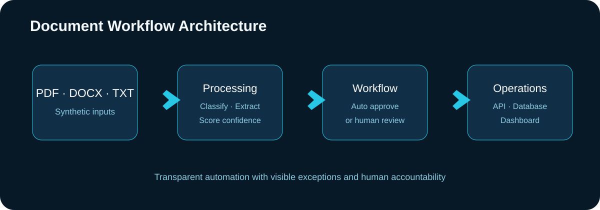

# AI-Assisted Document Workflow Automation

[](https://github.com/ArashAdeliNik/ai-document-workflow-automation/actions)

An end-to-end portfolio project that converts unstructured business documents into structured, reviewable workflow records. It combines deterministic document intelligence, confidence-based routing, human approval, an API, and an operations dashboard.



## Business problem

Teams frequently copy invoice, contract, and purchase-order data into operational systems by hand. This demo automates the repeatable part while routing uncertain results to a person instead of silently accepting them.

## Capabilities

- PDF, DOCX, and TXT ingestion
- Invoice, contract, purchase-order, and fallback classification
- Field extraction and concise processing summaries
- Confidence scoring and configurable review threshold
- Human approval/rejection workflow with reviewer notes and corrections
- SHA-256 duplicate detection
- Persistent document registry in SQLite
- FastAPI REST endpoints and interactive API documentation
- Streamlit operations dashboard
- Docker Compose startup, pytest coverage, Ruff, and GitHub Actions
- Fully synthetic sample documents; no confidential data

## Workflow

1. A user uploads a document.
2. The service validates the file, calculates a content hash, and extracts text.
3. Rules classify the document and extract target fields.
4. A confidence score routes the result to automatic approval or human review.
5. A reviewer can approve, reject, annotate, or correct extracted fields.
6. The dashboard exposes document volume, exception count, confidence, and type mix.

## Quick start with Docker

```bash
docker compose up --build
```

- Dashboard: http://localhost:8501
- API documentation: http://localhost:8000/docs
- Health check: http://localhost:8000/health

Upload a file from `sample_documents/` in the dashboard.

## Local development

```bash
python -m venv .venv
# Windows: .venv\Scripts\activate
# Linux/macOS: source .venv/bin/activate
pip install -r requirements-dev.txt
uvicorn app.main:app --reload
```

In a second terminal:

```bash
streamlit run app/dashboard.py
```

For a local dashboard, change the sidebar API URL to `http://localhost:8000`.

## API examples

```bash
curl -F "file=@sample_documents/invoice.txt" http://localhost:8000/documents
curl http://localhost:8000/documents?status=needs_review
curl -X POST http://localhost:8000/documents/1/review \
  -H "Content-Type: application/json" \
  -d '{"decision":"approved","note":"Validated against source."}'
```

## Architecture decisions

- **Safe automation:** low-confidence results require human review.
- **Idempotency:** the same bytes cannot create duplicate records.
- **Explainability:** extracted fields and confidence remain visible.
- **Separation of concerns:** processing, persistence, API, and UI are separate modules.
- **Portable demo:** SQLite and Docker minimize setup friction.

## Production evolution

For a production deployment, replace SQLite with PostgreSQL, add OCR for scanned images, connect a managed document-intelligence or LLM service behind a provider interface, use object storage, add authentication/RBAC, encrypt sensitive content, and export approved records to an ERP or CRM.

## Tests

```bash
pytest -q
ruff check app tests
```

## Project structure

```text
app/                 processing, database, API, and dashboard
sample_documents/    synthetic demo inputs
tests/               unit and workflow tests
docs/                architecture, demo, LinkedIn, and interview notes
assets/              portfolio visuals
docker-compose.yml   reproducible local stack
```

## Privacy

Every sample is synthetic. Do not upload real personal, financial, or confidential documents to a public demo.

## Author

**Arash Adeli Nik** — AI, Data & Automation Engineer  
[GitHub](https://github.com/ArashAdeliNik) · [LinkedIn](https://www.linkedin.com/in/arash-adeli-nik/)
